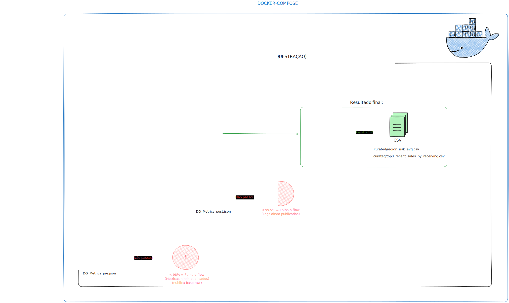

# ETL Local (Desafio Localiza)

Solução desenvolvida para o desafio técnico de Engenharia de Dados, com foco em simplicidade, qualidade e reprodutibilidade.

# 🛠️ Arquitetura

- Orquestração → Prefect 2 (UI em http://localhost:4200)
- Camada analítica → DuckDB (banco colunar leve, em arquivo único .duckdb)
- Transformações → SQL dentro do DuckDB
- Entrega → Resultados exportados em CSV

## Estrutura
```
├─ docker-compose.yml
├─ Dockerfile
├─ requirements.txt
├─ flows/pipeline.py
├─ input/df_fraud_credit.csv    # dataset de entrada (não versionado)
├─ data/results.duckdb          # banco gerado
└─ curated/
   ├─ region_risk_avg.csv
   └─ top3_recent_sales_by_receiving.csv
```

## Como rodar (Docker)
1. Coloque seu arquivo na pasta `input/` com nome `df_fraud_credit.csv` (ou ajuste a env var abaixo).
2. Construa e execute:
   ```bash
   docker compose up --build
   ```
   O container roda o pipeline e termina. Os artefatos ficam nas pastas montadas.

## Como rodar (local sem Docker)
```bash
pip install -r requirements.txt
python flows/pipeline.py
```

## O que o pipeline faz
1. **Ingestão local**: lê `./input/df_fraud_credit.csv`.
2. **Limpeza e padronização**:
   - `timestamp` → datetime (UTC); inválidos são descartados.
   - `amount` → numérico; negativos são tratados como inválidos (descartados).
   - `transaction_type` → normalizado para minúsculas (e.g., `sale`, `refund`).
   - `receiving_address` e `location_region` → `.str.strip()`, vazios/"0" viram `NaN`.
   - **Dedupe** por (`timestamp`,`receiving_address`,`transaction_type`,`amount`).
3. **Data Quality (automatizado)**: validações mínimas
   - Duas verificações são realizadas:
     1. **Camada raw**: validações no arquivo original, sem normalização ou tratamento.
   - Regras aplicadas:
     - Conformidade mínima de 98%; abaixo disso o job sai com código 2 (falha). Escrevendo a camada raw sem tratamentos para analises de erro
   - Métricas em `data/dq_metrics_pre.json`.
     2. **Após limpeza**: validações no dataset tratado.
   - Regras aplicadas:
     - `timestamp`, `transaction_type`, `amount` não nulos.
     - `amount >= 0`. 
     - Conformidade mínima de 99.5%; abaixo disso o job sai com código 2 (falha). Escrevendo a camada tratada para analises de erro.
   - Métricas em `data/dq_metrics_post.json`.
4. **Transformações (DuckDB)**:
   - Tabela `stg_transactions` (limpa) em `data/results.duckdb`.
   - **Resultado 1**: `region_risk_avg` (média de `risk_score` por `location_region`, desc.).
   - **Resultado 2**: `top3_recent_sales_by_receiving` (para cada `receiving_address`, pega a *última* transação `sale` por `timestamp` e lista o top 3 por `amount` desc.).
   - Exporta resultados para `./curated` em **CSV**.

## Variáveis de ambiente
- `INPUT_CSV` (default: `./input/df_fraud_credit.csv`)

## Arquitetura do Pipeline

Abaixo está a arquitetura do pipeline de ETL:



